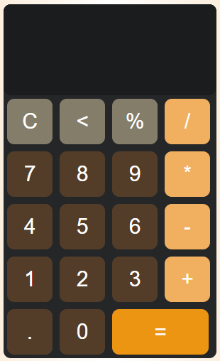
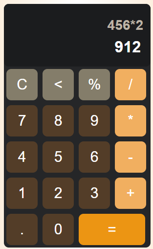
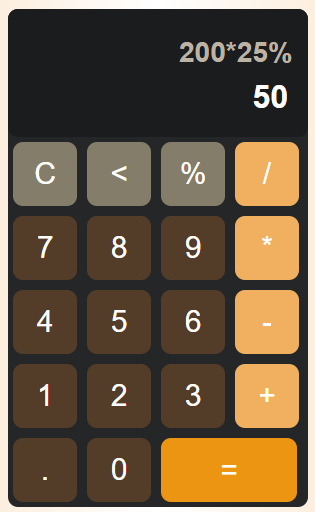
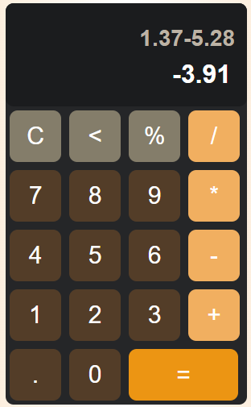

# Kalkulačka - ReactJS
Táto kalkulačka je vytvorená pomocou Reactu a umožňuje jednoduché matematické operácie.
* [![React][React.js]][React-url]


## Demo

https://patriksenko.github.io/calculator-app-react/


## Lokálne použitie

Stiahnite si alebo naklonujte tento projekt

```bash
  https://github.com/PatrikSenko/kalkulacka-senko.git
```

Choďte do priečinku projektu

```bash
  cd calculator-app-react-main
```

Nainštalujte závislosti pomocou príkazu

```bash
  npm install
```

Spustite aplikáciu pomocou príkazu

```bash
  npm start
```


## Funkcie

- Násobenie
- Delenie
- Sčítanie
- Odčítanie
- Percentá
- Anulovanie hodnoty


## Screenshots







## Authors

- [@PatrikSenko](https://www.github.com/PatrikSenko)

